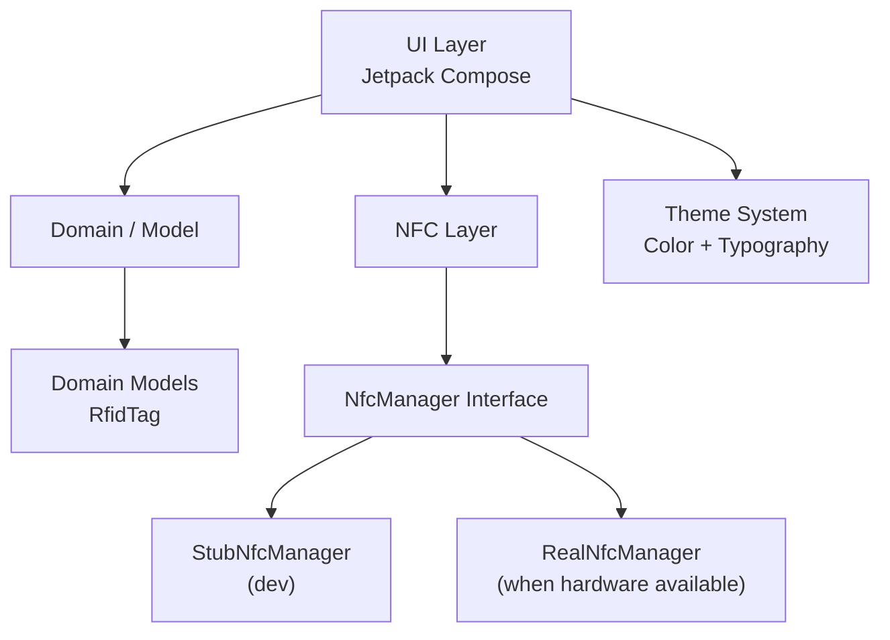
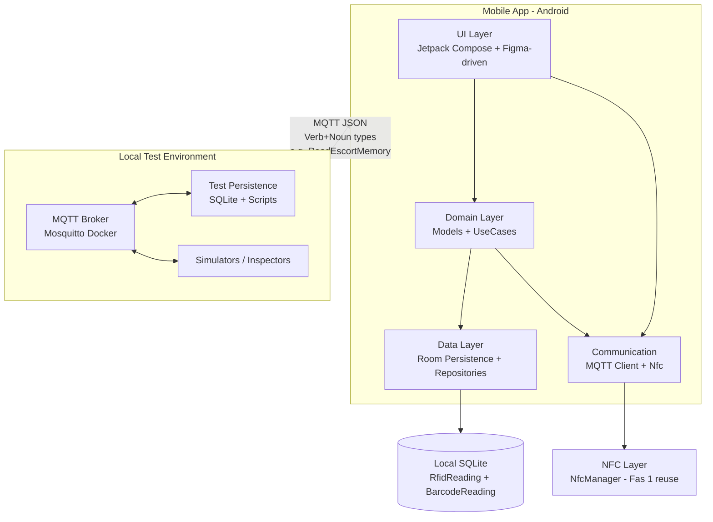

# App Architecture – RFID Manager

Denna sida beskriver den aktuella mjukvaruarkitekturen för applikationen **RFID Manager** (tidigare kallad HelloWorld under utvecklingen).

## Övergripande arkitektur



### Lager

| Lager          | Paket                          | Ansvar |
|----------------|--------------------------------|--------|
| **UI**         | `ui.screens`, `ui.theme`       | All Compose UI, skärmar, komponenter och tema |
| **Domain**     | `domain.model`                 | Rena domänmodeller (t.ex. `RfidTag`) |
| **NFC**        | `nfc`                          | Abstraktion för NFC-hårdvara (`NfcManager`) |
| **Data**       | (planeras)                     | Framtida repository-lager för persistent lagring av taggar |

## Communication Layer – MQTT / Sparkplug B (Fas 2)

För Fas 2 har en kommunikationslager lagts till för att skicka persisterade läsningar (RFID/EAN) till en central test-mottagare via MQTT.

- **Bibliotek**: Eclipse Paho MQTT Client (ren klient, ingen Android Service i nuvarande implementation).
- **Format**: Enkel JSON med fälten `type`, `uid`, `timestamp`, `source`, `sparkplug`, `data` (memoryBank, address, length, payload). Detta är en förenklad variant av Sparkplug B-koncept (verb+noun + metrics).
- **Topic**: `rfidmanager/<uid>/telemetry`
- **Testmiljö**: Lokal Docker Mosquitto + Python subscriber som persisterar till SQLite.

### Arkitekturella beslut

#### Kryptering av meddelanden (2026-06-07)

**Produktion:**
- All kommunikation skall ske krypterat (t.ex. MQTT över TLS på port 8883, eller wss://).
- Krypteringsnycklar, certifikathantering och mTLS/autentisering skall definieras i ett senare skede av projektet.

**Utveckling och test:**
- Under utveckling och mot den lokala Docker-testmiljön (192.168.50.128:1883) accepteras okrypterad trafik (tcp://) för att hålla setup enkel och debugging effektiv.
- Kryptering är ett senare problem i projektet och skjuts upp tills grundläggande persistens + kommunikation är validerad.

Detta beslut dokumenteras här för att undvika att det glöms bort när projektet skalas eller flyttas till riktig infrastruktur.

## Aktuell package-struktur (juni 2026)

```
com.joakim.rfidmanager
├── ui
│   ├── model              # Lätta UI-modeller (t.ex. RFIDTag för listor)
│   ├── screens
│   │   ├── RFIDManagerScreen.kt     # Huvudskärm (dashboard)
│   │   ├── RFIDTagList.kt
│   │   └── WriteTagForm.kt
│   └── theme
│       ├── Color.kt
│       ├── Type.kt
│       └── Theme.kt
├── domain
│   └── model
│       └── RfidTag.kt               # Domänmodell för fysiska taggar
└── nfc
    ├── NfcManager.kt                # Interface
    └── StubNfcManager.kt            # Stub för utveckling utan hårdvara
```

## RFIDManagerScreen – Huvudskärmen

Denna skärm är den centrala vyn och följer i stora drag Figma-designen "RFID MANAGER".

### Layout (från Figma)

```
┌────────────────────────────────────────────────────────────┐
│ [ READ | WRITE ]                     [ START SCAN (grön) ] │  ← Top bar
├──────────────────────────────┬─────────────────────────────┤
│                              │                             │
│  Radar (pulsande cirklar)    │   Tabs: READ LOG / WRITE TAG│
│                              │                             │
│  RFID SYSTEM STATUS          │   (READ LOG)                │
│  18:13:53  STANDBY           │   - Lista över taggar       │
│                              │   - UID, typ, RSSI, tid     │
│  [Total Reads] [Reads/Min]   │                             │
│  [Strong Sig ] [Weak Sig ]   │   (WRITE TAG)               │
│                              │   - Formulär                │
│  LAST DETECTED               │                             │
│                              │                             │
└──────────────────────────────┴─────────────────────────────┘
```

### Komponenter i RFIDManagerScreen

- **TopBar**: Segmenterad kontroll (Read/Write) + "START SCAN"-knapp
- **RadarView**: Enkel animerad radar gjord med `Canvas` + `InfiniteTransition`
- **SystemStatusCard**: Timestamp + status (t.ex. STANDBY)
- **StatCard** (återanvändbar): Fyra stycken i 2x2-grid
- **RFIDTagList**: Höger sida vid "READ LOG"-flik (se separat sektion nedan)
- **WriteTagForm**: Höger sida vid "WRITE TAG"-flik (enkelt formulär, work in progress)

### Urval och interaktion

- En tagg kan väljas i listan.
- Vald rad får grön vänsterkant + lätt bakgrund (enligt Figma).
- `onTagSelected` callback skickas upp till `MainActivity` (för framtida detaljvy eller skrivning till specifik tagg).

## RFIDTagList

Återanvändbar komponent som används i READ LOG-fliken.

**Förbättringar gjorda mot Figma (juni 2026):**

- Vänster grön accent + bakgrund vid urval
- Signalstyrka som tre vertikala staplar (färgkodade efter RSSI)
- Tidsstämpel per rad
- Monospace-typsnitt för UID och teknisk data
- Bra empty state ("NO TAGS DETECTED")
- Header "READ LOG" när listan inte är tom

## Framtida arkitektur (plan)

När riktig NFC-hårdvara finns på plats:

- `NfcManager` får en riktig implementation (`RealNfcManager`)
- Eventuellt ett `NfcRepository` eller `TagRepository` för att spara historik
- Eventuell `NfcViewModel` som kopplar UI till NFC-lagret

---

**Senast uppdaterad:** 2026-06-01

---

## Fas 2 Architecture – IoT, MQTT, Local Persistence & Semantic Messages (juni 2026+)

### Övergripande utökad arkitektur (Mermaid)



### Nya / utökade lager

| Lager              | Paket / Ansvar                                      | Fas 1 relation |
|--------------------|-----------------------------------------------------|---------------|
| **UI**             | `ui.screens`, `ui.components` (Figma-mappade namn) | Utökas med PersistedReadingsScreen, Mqtt screens |
| **Domain**         | `domain.model` (RfidReading, BarcodeReading, MessageType) + use cases | Utökas kraftigt |
| **Data / Persistence** | `data.local` (Room entities, DAOs, Database) + `domain.repository` | Nytt (tidigare "planeras") |
| **Communication / IoT** | `data.mqtt` (MqttClient, envelopes) + high-level repos | Nytt (ersätter/utökar "RealNfcManager" koncept) |
| **NFC**            | `nfc` (NfcManager interface + AndroidNfcManager)   | Oförändrat, återanvänds fullt |
| **Test Environment** | Docker Mosquitto + Python venv scripts (publish/subscribe + SQLite persist) | Nytt (lokal på dev-maskin) |

### Semantisk meddelandemodell (MQTT)

- **Protokoll:** MQTT 3/5 (pub/sub). Inget inbyggt "verb+noun" i MQTT-specen.
- **Rekommenderad modell (per användarens krav):**
  - **Topics:** Hierarkiska, stabila. Ex:
    - `rfidmanager/{deviceId}/telemetry` (mobil → test: readings)
    - `rfidmanager/{deviceId}/command` (test → mobil: requests)
  - **Payload:** Alltid **JSON**.
  - **Semantic type i payload:** "type": "ReadEscortMemory" (active verb + noun).
  - Exempel (se Nomenclature för full lista):
    ```json
    {
      "type": "ReadEscortMemory",
      "timestamp": "2026-06-04T...",
      "correlationId": "uuid",
      "payload": { "uid": "0479981A8A6A80", "page": 12, "dataHex": "74657374" }
    }
    ```
  - **Alternativ stark standard:** Sparkplug B (om kund kräver industriell interoperabilitet). Den har predefined Message Types (NDATA, NCMD, NBIRTH...) + strukturerad "metrics". Vi kan mappa våra verb till den vid behov.
- **Persistens:** Lokalt på mobil (Room). I testmiljö: valfritt (SQLite i Python-script eller Docker Postgres). Readings sparas med uid, raw data, parsed, timestamp, source (RFID/Barcode), sent flag.

### Persistence (lokal på telefon)

- Room + SQLite.
- Entiteter: `RfidReadingEntity`, `BarcodeReadingEntity` (se Nomenclature för exakta fält).
- Repository pattern: `ReadingRepository` (CRUD + query by type/date).
- UI: Lista över persisterade + "Transmit to MQTT" knapp (använder befintligt armed-pattern från Fas 1 för reliability).

### Testmiljö (lokal på dev-maskin)

- **MQTT Broker:** Docker `eclipse-mosquitto` (anonymous för test, port 1883). Se `~/rfid-fas2-test/mqtt/`.
- **Persistence i test:** Python venv + paho-mqtt + sqlite3. Script som subscribar på telemetry och sparar.
- **Simulering:** Enklare Python "mobil-sim" som publicerar test-data.
- **Inspektion:** `docker logs` eller utökad web-UI (t.ex. Node-RED eller custom) vid behov.
- **Fördel:** Helt offline, ingen molnkostnad, återanvändbar för Fas 2 testning.

### Barcode-stöd (framtida i Fas 2)

- Kamera via CameraX + ML Kit eller ZXing.
- Domän: `BarcodeReading`.
- UI: Ny knapp i huvudskärm + integrering i Persisted list.

### Figma-drivet arbetsflöde (ny betoning i Fas 2)

- Grok skapar **detaljerad designspec** (skärmar, exakta Component-namn, Variables, interactions) i wiki (Nomenclature + arkitektur).
- Namn är 1:1 med Compose-kod (t.ex. `RfidReadingCard`, `onTransmitReadings`).
- Användaren bygger i sin lokala Figma (gratis konto).
- När design klar: exportera (som i Fas 1) för token-extraktion + manuell Compose-implementation med rich comments.
- Detta gör Figma till "single source of truth" för namn och layouter.

**Senast uppdaterad:** 2026-06-04 (Fas 2 prep)
