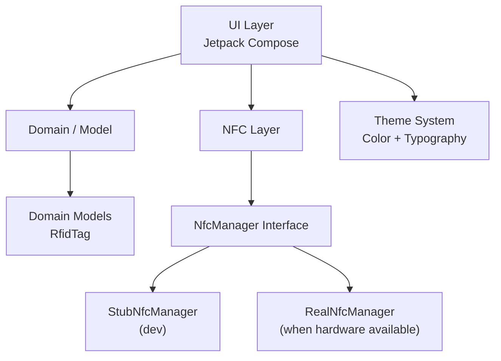

# App Architecture – RFID Manager

Denna sida beskriver den aktuella mjukvaruarkitekturen för applikationen **RFID Manager** (tidigare kallad HelloWorld under utvecklingen).

## Övergripande arkitektur



### Lager

| Lager          | Paket                          | Ansvar |
|----------------|--------------------------------|--------|
| **UI**         | `ui.screens`, `ui.theme`       | All Compose UI, skärmar, komponenter och tema |
| **Domain**     | `domain.model`                 | Rena domänmodeller (t.ex. `RfidTag`) |
| **NFC**        | `nfc`                          | Abstraktion för NFC-hårdvara (`NfcManager`) |
| **Data**       | (planeras)                     | Framtida repository-lager för persistent lagring av taggar |

## Aktuell package-struktur (juni 2026)

```
com.joakim.rfidmanager
├── ui
│   ├── model              # Lätta UI-modeller (t.ex. RFIDTag för listor)
│   ├── screens
│   │   ├── RFIDManagerScreen.kt     # Huvudskärm (dashboard)
│   │   ├── RFIDTagList.kt
│   │   └── WriteTagForm.kt
│   └── theme
│       ├── Color.kt
│       ├── Type.kt
│       └── Theme.kt
├── domain
│   └── model
│       └── RfidTag.kt               # Domänmodell för fysiska taggar
└── nfc
    ├── NfcManager.kt                # Interface
    └── StubNfcManager.kt            # Stub för utveckling utan hårdvara
```

## RFIDManagerScreen – Huvudskärmen

Denna skärm är den centrala vyn och följer i stora drag Figma-designen "RFID MANAGER".

### Layout (från Figma)

```
┌────────────────────────────────────────────────────────────┐
│ [ READ | WRITE ]                     [ START SCAN (grön) ] │  ← Top bar
├──────────────────────────────┬─────────────────────────────┤
│                              │                             │
│  Radar (pulsande cirklar)    │   Tabs: READ LOG / WRITE TAG│
│                              │                             │
│  RFID SYSTEM STATUS          │   (READ LOG)                │
│  18:13:53  STANDBY           │   - Lista över taggar       │
│                              │   - UID, typ, RSSI, tid     │
│  [Total Reads] [Reads/Min]   │                             │
│  [Strong Sig ] [Weak Sig ]   │   (WRITE TAG)               │
│                              │   - Formulär                │
│  LAST DETECTED               │                             │
│                              │                             │
└──────────────────────────────┴─────────────────────────────┘
```

### Komponenter i RFIDManagerScreen

- **TopBar**: Segmenterad kontroll (Read/Write) + "START SCAN"-knapp
- **RadarView**: Enkel animerad radar gjord med `Canvas` + `InfiniteTransition`
- **SystemStatusCard**: Timestamp + status (t.ex. STANDBY)
- **StatCard** (återanvändbar): Fyra stycken i 2x2-grid
- **RFIDTagList**: Höger sida vid "READ LOG"-flik (se separat sektion nedan)
- **WriteTagForm**: Höger sida vid "WRITE TAG"-flik (enkelt formulär, work in progress)

### Urval och interaktion

- En tagg kan väljas i listan.
- Vald rad får grön vänsterkant + lätt bakgrund (enligt Figma).
- `onTagSelected` callback skickas upp till `MainActivity` (för framtida detaljvy eller skrivning till specifik tagg).

## RFIDTagList

Återanvändbar komponent som används i READ LOG-fliken.

**Förbättringar gjorda mot Figma (juni 2026):**

- Vänster grön accent + bakgrund vid urval
- Signalstyrka som tre vertikala staplar (färgkodade efter RSSI)
- Tidsstämpel per rad
- Monospace-typsnitt för UID och teknisk data
- Bra empty state ("NO TAGS DETECTED")
- Header "READ LOG" när listan inte är tom

## Framtida arkitektur (plan)

När riktig NFC-hårdvara finns på plats:

- `NfcManager` får en riktig implementation (`RealNfcManager`)
- Eventuellt ett `NfcRepository` eller `TagRepository` för att spara historik
- Eventuell `NfcViewModel` som kopplar UI till NFC-lagret

---

**Senast uppdaterad:** 2026-06-01
