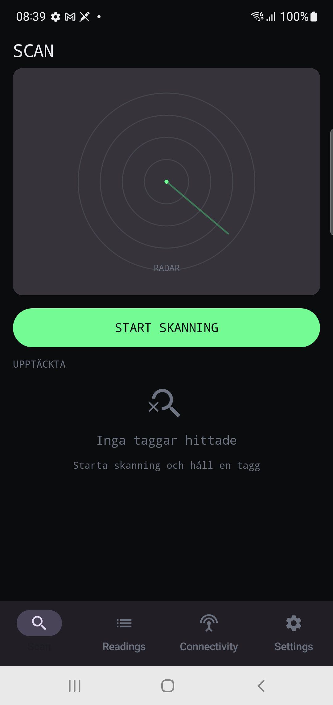
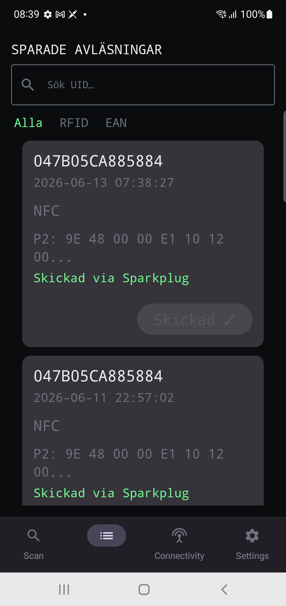
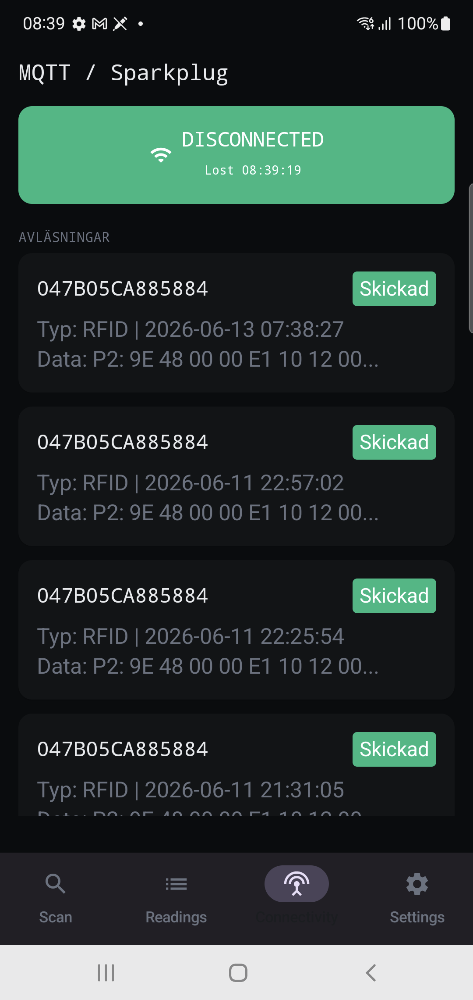
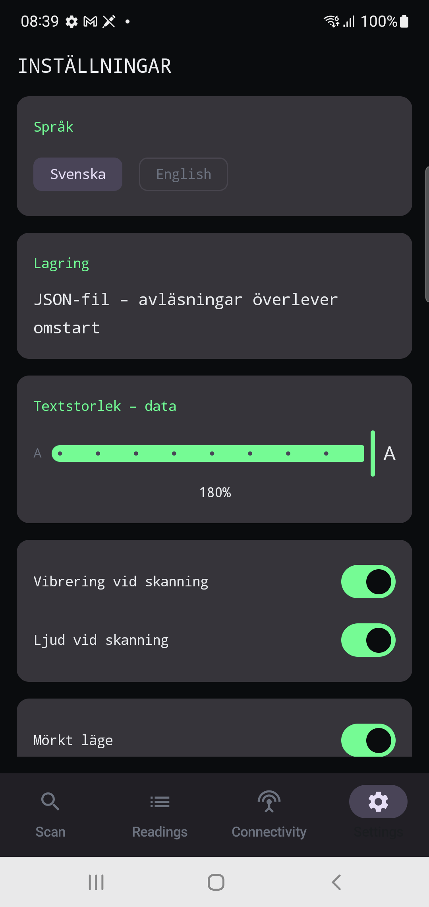

# Introduktion

**RFID Manager** är en Android-applikation för att läsa och skriva RFID- och NFC-taggar.
Appen är utvecklad för Samsung Galaxy Note 10 (Android 12) och liknande enheter med NFC-stöd.

## Huvudfunktioner

- **NFC-läsning och skrivning** av RFID-taggar (NFC Type 5)
- **Persisterad historik** — alla avläsningar sparas lokalt och finns kvar efter omstart
- **MQTT-publicering** — skicka avläsningar till en MQTT-broker för vidare bearbetning
- **Radarvy** — visuell representation av detekterade taggar med svepande radar
- **Export** — exportera avläsningar som CSV eller JSON
- **Anpassning** — språk, textstorlek, mörkt läge, haptik och ljud

## Teknisk miljö

| Parameter | Värde |
|---|---|
| Mål-Android | 12 (API 31) |
| Targetsdk | 36 |
| NFC-standard | ISO/IEC 15693 (NFC Type 5) |
| MQTT-klient | Paho 1.2.5 |
| Persistens | JSON-fallback i fil (Room redo när KSP stödjer AGP 9) |

# Navigering

Appen använder en bottennavigeringsrad med fyra vyer:

1. **Scan** — radarvy för live-skanning
2. **Readings** — lista över sparade avläsningar
3. **Connectivity** — MQTT-anslutningsstatus
4. **Settings** — alla inställningar

Tryck på en ikon i bottenfältet för att växla vy.



# Scan — Radar och skanning

Scan-vyn är appens huvudvy. Här sker all RFID-detektion i realtid.


## Radarn

Radarn visar:

- **Koncentriska ringar** — fyra ringar som hjälper till att visualisera avstånd
- **Sveplinje** — en linje som roterar medsols (0→360°) när skanning är aktiv
- **Efterglöd (trail)** — ett avklingande spår bakom sveplinjen (72° wedge) som bleknar gradvis
- **Tagg-punkter** — detekterade taggar visas som punkter på radarn

> **OBS:** När skanning inte är aktiv är sveplinjen stillastående och ingen trail visas.

## Starta / Stoppa skanning

Tryck på knappen **"Start Scan"** för att aktivera svepande radar.
Knappen ändras till **"Stop Scan"** när skanning är aktiv.
Tryck igen för att stoppa.

## Tagg-punkter

När en tagg detekteras:

1. En punkt visas på radarn med slumpmässig position (baserad på taggens UID)
2. Taggen får en medsols växande svansbåge som tonar bort över 72° av sveprotation
3. Under varvet visas taggens UID och typ i listan nedanför radarn

## Detected Tags-lista

Under radar och Start/Stop-knapp finns en lista över de sex senast detekterade taggarna.
Varje rad visar:

| Fält | Beskrivning |
|---|---|
| **UID** | Taggens unika identifierare (hexadecimal) |
| **Type** | RFID eller EAN |

# Readings — Sparade avläsningar

Readings-vyn visar alla persisterade avläsningar i en filtrerbar lista.



## Filter

Överst i listan finns filter-chips:

- **All** — visa alla avläsningar
- **RFID** — visa endast RFID-avläsningar
- **EAN** — visa endast EAN-avläsningar (framtida funktion)

## Sök

Sökfältet ovanför filtren låter dig söka på UID eller kod.
Stöd för wildcards:

- `*` — matchar godtycklig text (t.ex. `04*84`)
- `?` — matchar ett enskilt tecken (t.ex. `?BC05`)

Sökningen sker i realtid medan du skriver.

## Paginering

Listan visar ett begränsat antal avläsningar i taget.
Tryck **"Ladda fler"** längst ner för att visa nästa sida.
Antalet per sida (10–50) kan ställas in i Settings.

## Kortets innehåll

Varje avläsningskort visar:

| Fält | Beskrivning |
|---|---|
| **UID** | Taggens unika identifierare |
| **Timestamp** | Datum och tid för avläsning |
| **Source** | Källa (t.ex. "NFC Manual Read") |
| **Typ** | RFID / EAN |
| **Data Preview** | Förhandsvisning av läst data |
| **Status** | Transmit-status (Pending / Transmitted) |

# Connectivity — MQTT-status

Connectivity-vyn visar anslutningsstatus till MQTT-brokern samt historik över skickade meddelanden.



## Anslutningsstatus

Överst visas en statusindikator:

- **Grön** — ansluten till broker
- **Röd** — frånkopplad (appen försöker återansluta automatiskt var 35:e sekund)

Ikonen visar texten "CONNECTED" eller "DISCONNECTED".

## Hjärtbeat

En tidsstämpel visar när senaste keep-alive (hjärtslag) bekräftades från brokern.
Keep-alive skickas var 30:e sekund.

## Meddelandehistorik

Listan över skickade meddelanden visar för varje transaktion:

| Fält | Beskrivning |
|---|---|
| **UID** | Taggens UID |
| **Timestamp** | När meddelandet skickades |
| **Status** | Pending (väntar) / Transmitted (skickat) |
| **Data Preview** | Förhandsvisning av skickad data |

Tryck på ett meddelande för att se fullständig detalj (inklusive hela JSON-payloaden).

## Transmit-knapp

För avläsningar som ännu inte skickats (status "Pending") finns en **↑ Transmit**-knapp.
Tryck för att publicera avläsningen till MQTT-brokern omedelbart.

# Settings — Inställningar

Settings-vyn samlar alla användarinställningar.



## Språk (Language)

Välj mellan **Svenska** och **English**.
Byte sker omedelbart utan omstart.

## Textstorlek (Font Size)

Skjutreglage för att justera textstorleken i listor med avläsningar.

| Läge | Värde |
|---|---|
| Minsta | 1.0× (normal) |
| Största | 1.8× |

Inställningen påverkar Scan-, Readings- och Connectivity-vyerna.

## Haptik och Ljud

Två reglage:

- **Vibration on scan** — kort vibration (80 ms) när en tagg detekteras
- **Sound on scan** — pip-ljud (880 Hz, 100 ms) när en tagg detekteras

Båda är På / Av och sparas över omstart.

## Mörkt läge (Dark Mode)

En reglage som växlar mellan ljust och mörkt tema:

- **Av** — ljust tema (vit bakgrund, mörk text)
- **På** — mörkt tema (mörk bakgrund, ljus text)

Byte sker omedelbart.

## Export

Två knappar för att exportera alla avläsningar:

- **Export CSV** — exporterar som kommaseparerad text
- **Export JSON** — exporterar som JSON-array

Vid tryck öppnas Android Share Sheet där du kan spara filen, mejla den, etc.
Knapparna är inaktiva (grå) om inga avläsningar finns.

## Sidstorlek (Page Size)

Skjutreglage för hur många avläsningar som visas per "Ladda fler" i Readings-vyn.

| Läge | Antal |
|---|---|
| Minsta | 10 |
| Största | 50 |
| Steg | 10 |

# Vanliga flöden

## 1. Skanna en RFID-tagg

1. Gå till **Scan**-vyn
2. Tryck **"Start Scan"** — radarn börjar svepa
3. Håll en RFID-tagg mot telefonens baksida (NFC-området)
4. Appen vibrerar och piper — taggen visas på radarn
5. Tryck **"Stop Scan"** när du är klar
6. Taggen finns nu i Readings-listan

## 2. Visa sparade avläsningar

1. Gå till **Readings**-vyn
2. Alla avläsningar visas i kronologisk ordning (senaste först)
3. Använd sökfältet för att hitta specifika UID:n
4. Använd filter-chips för att begränsa till RFID eller EAN

## 3. Skicka en avläsning till MQTT

1. Gå till **Connectivity**-vyn — kontrollera att status är grön (CONNECTED)
2. Gå till **Readings**-vyn
3. Hitta en avläsning med status "Pending"
4. Tryck på **Transmit**-knappen (↑)
5. Gå tillbaka till **Connectivity** för att se att meddelandet skickats

> **Tips:** Om anslutningen är bruten försöker appen automatiskt återansluta var 35:e sekund.

## 4. Ändra språk

1. Gå till **Settings**-vyn
2. Under **Language**, välj Svenska eller English
3. All text uppdateras omedelbart

## 5. Exportera data

1. Gå till **Settings**-vyn
2. Under **Export**, tryck **"Export CSV"** eller **"Export JSON"**
3. Välj i Share Sheet vart du vill spara filen (t.ex. Google Drive, mejl, Nedladdningar)

## 6. Aktivera mörkt läge

1. Gå till **Settings**-vyn
2. Slå på **Dark Mode**-reglaget
3. Hela appen växlar till mörkt tema omedelbart

# Felsökning

## Ingen MQTT-anslutning

| Orsak | Lösning |
|---|---|
| Broker ej igång | Starta Docker-behållaren: `docker start mosquitto` |
| Fel IP/port | Kontrollera broker-URL i koden (för närvarande hårdkodad) |
| Nätverksproblem | Kontrollera att telefonen och brokern är på samma nätverk |

## Taggen detekteras inte

- Håll taggen mot telefonens NFC-område (övre delen av baksidan)
- Försök med olika vinklar och positioner
- Kontrollera att NFC är aktiverat i telefonens inställningar
- Vissa taggar kräver starkare magnetfält — prova med en annan tagg

## Appen kraschar

- Uppdatera till senaste versionen
- Kontrollera att Android 12+ används
- Rapportera buggar med logcat-utdata

# Tekniska anteckningar

## MQTT-meddelandeformat

Meddelanden publiceras på topic `rfidmanager/<UID>/telemetry` i JSON-format:

```json
{
  "type": "ReadEscortMemory",
  "uid": "047B05CA885884",
  "timestamp": "2026-06-13T12:00:00Z",
  "source": "NFC Manual Read",
  "sparkplug": true,
  "data": {
    "memoryBank": 3,
    "address": 4,
    "length": 4,
    "payload": "74655400"
  }
}
```

## Filstruktur för sparade data

Avläsningar sparas i appens interna lagring: `context.filesDir/readings.json`.

Formatet är en JSON-array av samma struktur som ovan (utan sparkplug-fältet).

Vid omstart läses filen in och alla avläsningar återställs.
