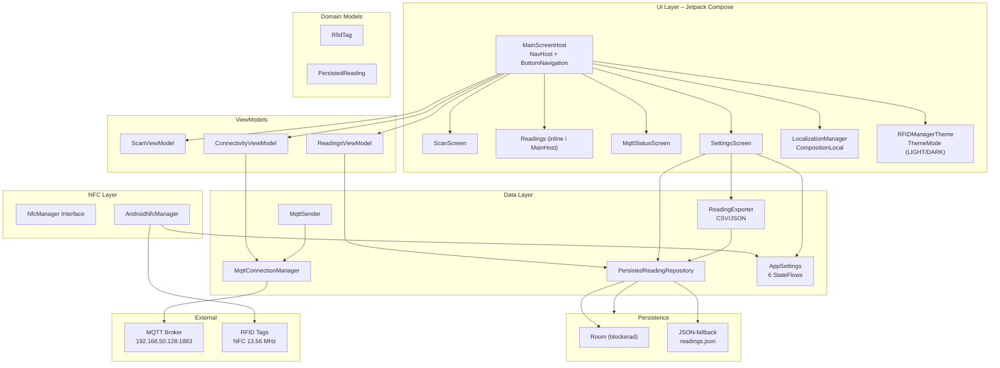
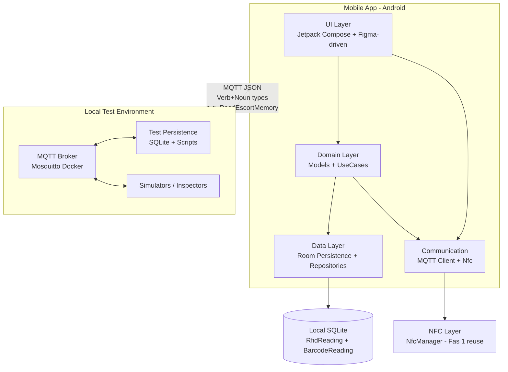

# App Architecture – RFID Manager

Denna sida beskriver den aktuella mjukvaruarkitekturen för applikationen **RFID Manager**.
Senast uppdaterad 2026-06-13 — täcker Fas 3 (navigation, ViewModels, spacing), Fas 4 (i18n, dark mode, MQTT, export, haptik, sök, paginering) och Fas 5 (kodgenomgång, dynamisk layout, radar trail, tag-svansar).

## Övergripande arkitektur



### Lager

| Lager          | Paket                              | Ansvar |
|----------------|------------------------------------|--------|
| **UI**         | `ui/screens`, `ui/theme`, `ui/components` | Compose UI: 4 skärmar, navigation, temahantering (LIGHT/DARK), i18n |
| **ViewModels** | `ui/viewmodel`                     | State per vy: scanning, readings, MQTT-anslutning |
| **Data**       | `data/repository`, `data/settings`, `data/mqtt`, `data/export` | Repository, SharedPreferences, MQTT, CSV/JSON-export |
| **Persistence** | `data.local`                       | Room (blockerad) + JSON-fallback i filesDir |
| **NFC**        | `nfc`                              | NfcManager interface + AndroidNfcManager (reader mode, vibration, ljud) |
| **Domain**     | `domain.model`                     | Rena modeller: RfidTag, PersistedReading, MessageType |
| **External**   | —                                  | MQTT-broker (Docker Mosquitto), fysiska NFC-taggar |

## Communication Layer – MQTT / Sparkplug B (Fas 2)

För Fas 2 har en kommunikationslager lagts till för att skicka persisterade läsningar (RFID/EAN) till en central test-mottagare via MQTT.

- **Bibliotek**: Eclipse Paho MQTT Client (ren klient, ingen Android Service i nuvarande implementation).
- **Format**: Enkel JSON med fälten `type`, `uid`, `timestamp`, `source`, `sparkplug`, `data` (memoryBank, address, length, payload). Detta är en förenklad variant av Sparkplug B-koncept (verb+noun + metrics).
- **Topic**: `rfidmanager/<uid>/telemetry`
- **Testmiljö**: Lokal Docker Mosquitto + Python subscriber som persisterar till SQLite.

### Arkitekturella beslut

#### Kryptering av meddelanden (2026-06-07)

**Produktion:**
- All kommunikation skall ske krypterat (t.ex. MQTT över TLS på port 8883, eller wss://).
- Krypteringsnycklar, certifikathantering och mTLS/autentisering skall definieras i ett senare skede av projektet.

**Utveckling och test:**
- Under utveckling och mot den lokala Docker-testmiljön (192.168.50.128:1883) accepteras okrypterad trafik (tcp://) för att hålla setup enkel och debugging effektiv.
- Kryptering är ett senare problem i projektet och skjuts upp tills grundläggande persistens + kommunikation är validerad.

Detta beslut dokumenteras här för att undvika att det glöms bort när projektet skalas eller flyttas till riktig infrastruktur.

## För nybörjare: DAO vs In-memory StateFlow (enkelt förklarat)

Detta är en viktig del av hur vi lagrar data i appen (t.ex. sparade RFID-läsningar).

**In-memory StateFlow** (det tillfälliga alternativet vi använt hittills):
- Som en lista du håller i huvudet eller skriver på en lapp.
- Snabbt och enkelt att jobba med under utveckling.
- All data försvinner om du stänger appen, startar om telefonen eller force-stoppar appen.
- Bra för snabb testning av hela flödet (spara → Transmit → MQTT) utan att behöva en riktig databas igång.
- I koden: Vi använder en `MutableStateFlow` som håller en lista i minnet.

**DAO (Data Access Object) + Room** (det riktiga alternativet):
- Som att skriva in saker i en riktig anteckningsbok eller databas på telefonen.
- Data sparas permanent på telefonen (i SQLite). Den överlever app-omstart, telefon-omstart och force-stop.
- Detta är vad vi vill ha i den färdiga appen.
- DAO är "kontaktpersonen" som pratar med databasen åt oss. Den har metoder som `getAll()`, `insert()`, `markAsTransmitted()` etc.
- Room är biblioteket från Google som gör det lätt att använda SQLite i Android på ett modernt sätt.

**Varför har vi båda samtidigt? (dual-mode)**
Under Fas 2 hade vi tekniska problem med att få databas-verktygen (KSP) att bygga korrekt. För att ändå kunna testa hela kedjan (NFC → spara → Transmit-knapp → MQTT-meddelande) byggde vi in en "reservplan":
- Om det finns en riktig DAO → använd databasen.
- Om det inte finns någon DAO (null) → använd den tillfälliga minneslistan.

Detta gör att UI-koden (skärmar, listor, Transmit-knapp) inte bryr sig om var datan kommer ifrån. Den frågar bara "ge mig listan över sparade läsningar".

**Vad betyder det för Fas 3?**
I Fas 3 vill vi slå på den riktiga databasen (DAO + Room). Då kommer sparade läsningar att finnas kvar även efter att du stängt appen. Det är ett av acceptanskriterierna för Fas 3.

Du som användare/testare behöver inte förstå koden – du kommer märka skillnaden genom att:
- Data överlever app-omstart.
- Du kan stänga appen helt och öppna den igen och se dina tidigare läsningar.

## Arkitekturbeslut för Fas 3 (låsta 2026-06-07)

### 1. Navigation
**Beslut:** Vi inför `androidx.navigation.compose` för Fas 3.

**Motivering:**
- Möjliggör riktig bottom navigation med dedikerade destinations.
- Hanterar back-stack, state preservation och deep linking på ett idiomatiskt Compose-sätt.
- Gör det enkelt att uppfylla acceptanskriterierna för "dedikerade vyer istället för trånga tabs".

**Konsekvens:**
- `RFIDManagerScreen` blir en "host" som sätter upp `NavHost` + `BottomNavigation`.
- Varje huvudvy (Scan, Readings, Connectivity, Settings) blir en egen `@Composable` destination.
- Navigation sker via `navController.navigate(...)`.

### 2. State Management & ViewModels
**Beslut:** Vi inför ViewModel per vy + en lätt "AppViewModel" för delad state.

**Motivering:**
- MainActivity ska inte längre hoista all state (det blev för tungt i Fas 2).
- Varje skärm (t.ex. `PersistedReadingsScreen`, `MqttStatusScreen`) får egen ViewModel som observerar `PersistedReadingRepository` och eventuell MQTT-status.
- En gemensam `AppViewModel` (eller bara Repository flows) hanterar saker som delas globalt (t.ex. aktuell MQTT-anslutning, senaste transmitted reading).

**Konsekvens:**
- `AppContainer` utökas med ViewModel factories (eller vi använder `viewModel()` i Compose).
- State hoisting flyttas från `MainActivity` till ViewModels.
- UI blir renare och lättare att testa.

Dessa beslut är låsta efter diskussion med Kund 2026-06-07.

Se detaljerad design och kodskiss i [[Fas3-Navigation-Spacing-Design]].

## Aktuell package-struktur (juni 2026)

```
com.joakim.rfidmanager
├── MainActivity.kt              # Glue: NFC-livscykel, AppContainer, setContent
├── ui/
│   ├── MainScreenHost.kt        # NavHost + BottomNavigation (4 destinations)
│   ├── Localized.kt             # CompositionLocal + str() helper
│   ├── navigation/
│   │   └── Screen.kt            # Sealed class (Scan, Readings, Connectivity, Settings)
│   ├── screens/
│   │   ├── ScanScreen.kt        # Radar, sweep trail (drawArc 72° wedge), tag-svansar, start/stop scan, tag-lista, persist
│   │   ├── SettingsScreen.kt    # Alla inställningar (språk, font, haptik, ljud, dark mode, page size, export)
│   │   ├── MqttStatusScreen.kt  # MQTT-status, heartbeat, meddelande-detalj (AlertDialog på click)
│   │   └── (PersistedReadingsScreen borttagen — inline i MainScreenHost)
│   ├── components/
│   │   └── PersistedListItem.kt # Reading-kort med status, tidsstämpel, Transmit-knapp
│   ├── viewmodel/
│   │   ├── ScanViewModel.kt     # selectedTagUid
│   │   ├── ReadingsViewModel.kt # readings, filter, sök, paginering, Transmit
│   │   └── ConnectivityViewModel.kt # MQTT-status + heartbeat från MqttConnectionManager
│   ├── model/
│   │   └── RFIDTag.kt           # UI-modell för listor
│   └── theme/
│       ├── Color.kt             # Primär #00FF88, accent #F59E0B, statusfärger
│       ├── Type.kt              # Inter + JetBrains Mono
│       ├── Theme.kt             # RFIDManagerTheme (LIGHT/DARK), LightColorScheme
│       └── Dimens.kt            # Spacing-konstanter (cardPadding, sectionSpacing, etc.)
├── domain/
│   └── model/
│       ├── RfidTag.kt           # Domänmodell för fysiska taggar
│       └── PersistedReading.kt  # Domänmodell för sparade läsningar
├── data/
│   ├── local/
│   │   ├── AppDatabase.kt       # Room-databas (blockerad — se roadmap)
│   │   └── DatabaseProvider.kt  # Dual-mode: Room eller null → JSON-fallback
│   ├── repository/
│   │   └── PersistedReadingRepository.kt  # CRUD + getAllReadings Flow
│   ├── mqtt/
│   │   ├── MqttConnectionManager.kt  # Persistent MQTT-anslutning + StateFlows
│   │   └── MqttSender.kt             # Delad anslutning från MqttConnectionManager
│   ├── settings/
│   │   └── AppSettings.kt       # SharedPreferences + StateFlows (6 st: font, haptik, ljud, theme, pageSize)
│   ├── localization/
│   │   └── LocalizationManager.kt  # Laddar JSON-lexikon, exponerar StateFlow
│   ├── export/
│   │   └── ReadingExporter.kt   # CSV/JSON + FileProvider + Share Sheet
│   └── di/
│       └── AppContainer.kt      # Initierar alla singletons (settings, repo, mqtt, localization)
├── nfc/
│   ├── NfcManager.kt            # Interface
│   ├── AndroidNfcManager.kt     # Riktig implementation (reader mode, handleTag, write)
│   └── StubNfcManager.kt        # Stub för emulator
├── assets/
│   ├── strings_sv.json          # Svenska lexikon (75+ nycklar)
│   └── strings_en.json          # Engelska lexikon
└── res/
    ├── raw/beep.wav             # 880 Hz pip vid scan
    ├── xml/nfc_tech_filter.xml  # NFC intent-filter för chooser fallback
    └── xml/file_paths.xml       # FileProvider cache-sökväg
```

## Navigation (Fas 3)

| Destination  | Route        | Composable                         | ViewModel             |
|-------------|-------------|------------------------------------|----------------------|
| Scan        | `scan`      | `ScanScreen`                       | `ScanViewModel`      |
| Readings    | `readings`  | Inline i `MainScreenHost`          | `ReadingsViewModel`  |
| Connectivity| `connectivity` | `MqttStatusScreen`              | `ConnectivityViewModel` |
| Settings    | `settings`  | `SettingsScreen`                   | — (stateless)        |

Bottom navigation med 4 items i `NavigationBar`. `NavHost` med `launchSingleTop = true` för alla destinationer.

## AppSettings StateFlows

| Flow             | Typ     | Default | Intervall    |
|-----------------|---------|---------|-------------|
| `fontSizeScale` | Float   | 1.0f    | 1.0–1.8 (9 steg) |
| `hapticEnabled` | Boolean | true    | —           |
| `soundEnabled`  | Boolean | true    | —           |
| `themeMode`     | Enum    | DARK    | LIGHT/DARK  |
| `pageSize`      | Int     | 50      | 10–50 (steg 10) |

Språk hanteras av `LocalizationManager` (separat från AppSettings).

## MQTT-arkitektur (Fas 4)

- `MqttConnectionManager` — klass (inte object), persistent TCP-anslutning som startas vid app-start.
- StateFlows: `connectionStatus` ("CONNECTED"/"DISCONNECTED"), `lastHeartbeat` (String).
- Automatisk återanslutning var 35:e sekund. Keep-alive var 30:e sekund.
- `MqttSender` använder delad anslutning från MqttConnectionManager (ingen egen connect).
- `ConnectivityViewModel` läser från MqttConnectionManager — ingen demo-data.
- Broker: `192.168.50.128:1883` (Docker eclipse-mosquitto, okrypterat för dev).

## Temahantering (Fas 4)

- `ThemeMode` enum (LIGHT/DARK) med Switch i Settings.
- `RFIDManagerTheme` accepterar `themeMode` istället för `darkTheme: Boolean`.
- Alla skärmar migrerade från hårdkodade `Color.kt`-värden till `MaterialTheme.colorScheme.*`.
- `LightColorScheme` med vit bakgrund och mörk text.

## Paginering (Fas 4)

- `ReadingsViewModel`: `_displayLimit` (StateFlow), `_hasMore`, `loadMore()`.
- `loadMore()` ökar `_displayLimit` med `settings.pageSize.value`.
- Filter/sök-ändring återställer `_displayLimit` till `pageSize`.
- UI: "Ladda fler"-knapp i botten av LazyColumn när `hasMore=true`.
- Knapptexten visar dynamisk sidstorlek: "Ladda fler (20)".

## Dynamisk layout (Fas 5)

- `PersistedListItem.kt`: vid `fontSizeScale > 1.3×` staplas UID+timestamp och dataPreview+status vertikalt (istället för horisontellt).
- Alla `Spacer`-höjder skalas proportionellt med `fontSizeScale`.
- `maxLines` + `TextOverflow.Ellipsis` på alla textfält — ingen text kapas vid stor font.
- `MqttStatusScreen.kt`: UID får `weight(1f)`, type/timestamp-rad får 2 rader vid stor text.
- `ScanScreen.kt`: maxLines-skydd på tag-UID och type-text.

## Radar sweep trail (Fas 5)

Samtliga ändringar är inom `ScanScreen.kt` — inga nya komponenter eller arkitektoniska lager.

- **Sveplinje:** `infiniteTransition` animerar 0→360° över 4 sekunder (LinearEasing, RepeatMode.Restart).
- **Trail (efterglöd):** 72° wedge bakom sveplinjen, 72 drawArc-segment (1° per slice), alpha 0.25–0.65 (linjär fade).
  - `useCenter = true`, `Fill` — fyller wedge från centrum till radarkanten.
  - Ritas ovanpå sveplinjen för sömlös övergång.
  - Endast synlig när `scanningEnabled = true`.
- **Tag-svansar:** Varje detekterad tagg får en medsols växande båge (stroke 4dp) som startar vid taggens position och växer framåt i svepriktning.
  - Längd = `diff` grader (0→72° i takt med sveplinjens rörelse).
  - Alpha 0.4→0 linjär fade över 72° rotation.
  - `useCenter = false`, `Stroke(width = 4.dp.toPx())`.

## Bugghanteringssystem

- Formella buggrapporter lagras i `wiki/bugs/` med YAML-frontmatter och sekventiellt ID (BUG-001, BUG-002...).
- Varje bugg får ett eget Kanban-kort i [[Kanban]].
- Mall finns i [[bugs/README]].
- Exempel: [[bugs/2026-06-13-connectivity-message-detail|BUG-001]] — Connectivity detaljvy (AlertDialog för meddelande-metadata).

---

**Senast uppdaterad:** 2026-06-13

---

## Fas 2 Architecture – IoT, MQTT, Local Persistence & Semantic Messages (juni 2026+)

### Övergripande utökad arkitektur (Mermaid)



### Nya / utökade lager

| Lager              | Paket / Ansvar                                      | Fas 1 relation |
|--------------------|-----------------------------------------------------|---------------|
| **UI**             | `ui.screens`, `ui.components` (Figma-mappade namn) | Utökas med PersistedReadingsScreen, Mqtt screens |
| **Domain**         | `domain.model` (RfidReading, BarcodeReading, MessageType) + use cases | Utökas kraftigt |
| **Data / Persistence** | `data.local` (Room entities, DAOs, Database) + `domain.repository` | Nytt (tidigare "planeras") |
| **Communication / IoT** | `data.mqtt` (MqttClient, envelopes) + high-level repos | Nytt (ersätter/utökar "RealNfcManager" koncept) |
| **NFC**            | `nfc` (NfcManager interface + AndroidNfcManager)   | Oförändrat, återanvänds fullt |
| **Test Environment** | Docker Mosquitto + Python venv scripts (publish/subscribe + SQLite persist) | Nytt (lokal på dev-maskin) |

### Semantisk meddelandemodell (MQTT)

- **Protokoll:** MQTT 3/5 (pub/sub). Inget inbyggt "verb+noun" i MQTT-specen.
- **Rekommenderad modell (per användarens krav):**
  - **Topics:** Hierarkiska, stabila. Ex:
    - `rfidmanager/{deviceId}/telemetry` (mobil → test: readings)
    - `rfidmanager/{deviceId}/command` (test → mobil: requests)
  - **Payload:** Alltid **JSON**.
  - **Semantic type i payload:** "type": "ReadEscortMemory" (active verb + noun).
  - Exempel (se Nomenclature för full lista):
    ```json
    {
      "type": "ReadEscortMemory",
      "timestamp": "2026-06-04T...",
      "correlationId": "uuid",
      "payload": { "uid": "0479981A8A6A80", "page": 12, "dataHex": "74657374" }
    }
    ```
  - **Alternativ stark standard:** Sparkplug B (om kund kräver industriell interoperabilitet). Den har predefined Message Types (NDATA, NCMD, NBIRTH...) + strukturerad "metrics". Vi kan mappa våra verb till den vid behov.
- **Persistens:** Lokalt på mobil (Room). I testmiljö: valfritt (SQLite i Python-script eller Docker Postgres). Readings sparas med uid, raw data, parsed, timestamp, source (RFID/Barcode), sent flag.

### Persistence (lokal på telefon)

- Room + SQLite.
- Entiteter: `RfidReadingEntity`, `BarcodeReadingEntity` (se Nomenclature för exakta fält).
- Repository pattern: `ReadingRepository` (CRUD + query by type/date).
- UI: Lista över persisterade + "Transmit to MQTT" knapp (använder befintligt armed-pattern från Fas 1 för reliability).

### Testmiljö (lokal på dev-maskin)

- **MQTT Broker:** Docker `eclipse-mosquitto` (anonymous för test, port 1883). Se `~/rfid-manager/test/fas2-mqtt/mqtt/`.
- **Persistence i test:** Python venv + paho-mqtt + sqlite3. Script som subscribar på telemetry och sparar.
- **Simulering:** Enklare Python "mobil-sim" som publicerar test-data.
- **Inspektion:** `docker logs` eller utökad web-UI (t.ex. Node-RED eller custom) vid behov.
- **Fördel:** Helt offline, ingen molnkostnad, återanvändbar för Fas 2 testning.

### Barcode-stöd (framtida i Fas 2)

- Kamera via CameraX + ML Kit eller ZXing.
- Domän: `BarcodeReading`.
- UI: Ny knapp i huvudskärm + integrering i Persisted list.

### Figma-drivet arbetsflöde (ny betoning i Fas 2)

- Grok skapar **detaljerad designspec** (skärmar, exakta Component-namn, Variables, interactions) i wiki (Nomenclature + arkitektur).
- Namn är 1:1 med Compose-kod (t.ex. `RfidReadingCard`, `onTransmitReadings`).
- Användaren bygger i sin lokala Figma (gratis konto).
- När design klar: exportera (som i Fas 1) för token-extraktion + manuell Compose-implementation med rich comments.
- Detta gör Figma till "single source of truth" för namn och layouter.

**Senast uppdaterad:** 2026-06-04 (Fas 2 prep)
