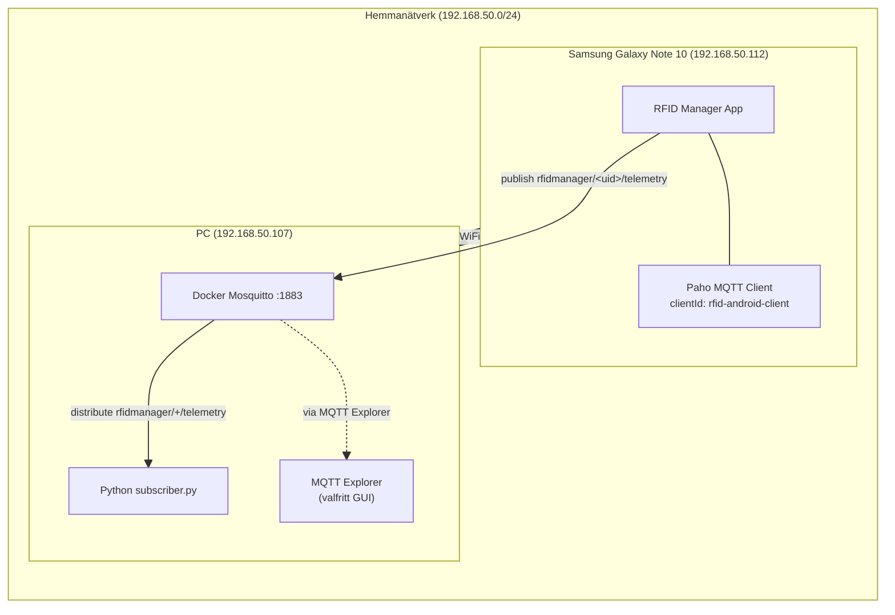
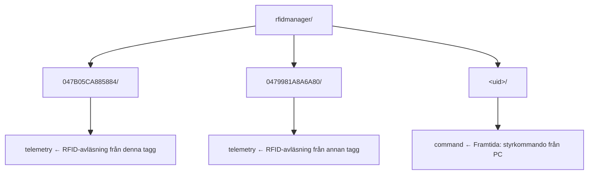

# MQTT-infrastruktur och nätverkslandskap

> **Fas-100** — Fördjupning i MQTT-protokollet och den infrastruktur som RFIDManager agerar i.
> Målet är att förstå hela kedjan från app → broker → subscriber, och vilka verktyg som finns för att övervaka och felsöka.

---

## Innehållsförteckning

1. [MQTT-protokollet — grunderna](#1-mqtt-protokollet--grunderna)
2. [Vår broker: Eclipse Mosquitto](#2-vår-broker-eclipse-mosquitto)
3. [Topologi och nätverk](#3-topologi-och-nätverk)
4. [Topics](#4-topics)
5. [Meddelandeformat](#5-meddelandeformat)
6. [Kvalitet på leverans (QoS)](#6-kvalitet-på-leverans-qos)
7. [Återanslutning och keep-alive](#7-återanslutning-och-keep-alive)
8. [Säkerhet](#8-säkerhet)
9. [Verktyg](#9-verktyg)
10. [Flöde: från scan till mottaget meddelande](#10-flöde-från-scan-till-mottaget-meddelande)
11. [Kända begränsningar och framtida förbättringar](#11-kända-begränsningar-och-framtida-förbättringar)
12. [Referenser](#12-referenser)

---

## 1. MQTT-protokollet — grunderna

[MQTT](https://mqtt.org/) (Message Queuing Telemetry Transport) är ett lättviktigt publish/subscribe-protokoll designat för IoT-enheter med begränsad bandbredd och strömförbrukning.

### Nyckelkoncept

| Koncept | Förklaring |
|---------|-----------|
| **Broker** | Central server som tar emot och distribuerar meddelanden |
| **Publisher** | Enhet som skickar meddelanden (t.ex. RFID Manager-appen) |
| **Subscriber** | Enhet som prenumererar på meddelanden (t.ex. Python-skriptet) |
| **Topic** | Kategori/kanal för meddelanden, hierarkisk med `/` |
| **Wildcard** | `+` (en nivå) och `#` (flera nivåer) för att prenumerera på flera topics |
| **QoS** | Quality of Service — garanti för leverans (0, 1, 2) |
| **Keep-alive** | Periodisk ping för att upprätthålla anslutningen |
| **Will message** | "Sista vilja" — meddelande som skickas om enheten oväntat kopplar från |
| **Retained message** | Senaste meddelandet sparas på brokern för nya prenumeranter |

### Varför MQTT?

- **Låg overhead:** Minimal header (2 bytes) jämfört med HTTP
- **Asynkront:** Publisher och subscriber behöver inte vara samtidigt uppkopplade
- **Skalbart:** En broker kan hantera tusentals enheter
- **Välbeprövat:** Standard inom IoT, industriell automation (via Sparkplug)

---

## 2. Vår broker: Eclipse Mosquitto

### Version och källa

- **Programvara:** [Eclipse Mosquitto](https://mosquitto.org/) — open source MQTT broker
- **Distribution:** Docker Hub (`eclipse-mosquitto:latest`)
- **Protokoll:** MQTT 3.1.1 (även stöd för 5.0)

### Konfiguration

**Fil:** `~/projects/rfid/rfid-manager/test/fas2-mqtt/mqtt/mosquitto.conf`

```ini
listener 1883
allow_anonymous true
persistence true
persistence_location /mosquitto/data/
log_dest stdout
```

#### Parameter-förklaring

| Direktiv | Värde | Betydelse | Not |
|----------|-------|-----------|-----|
| `listener` | 1883 | Port för MQTT (cleartext TCP) | MQTT-standard. Kan ha flera listeners, t.ex. `listener 8883` för TLS |
| `allow_anonymous` | true | Vem som helst får ansluta utan lösenord | **Säkerhetsrisk** i öppen miljö. Sätt `false` + `password_file` för produktion |
| `persistence` | true | Meddelanden/sessioner sparas till disk | Data finns kvar efter omstart (i Docker-volym) |
| `persistence_location` | /mosquitto/data/ | Sökväg inuti containern | Mappad Docker-volym enligt `docker inspect` |
| `log_dest` | stdout | Loggar till konsolen | Samlas av Docker (`docker logs`). Alternativ: `log_dest file /mosquitto/log/mosquitto.log` |

**Vad är inte konfigurerat?** (alla standard, inga begränsningar):
- `max_connections` → obegränsat (standard: -1)
- `allow_zero_length_clientid` → true (standard)
- `keepalive_interval` → 60 sek (standard)

### Starta brokern

```bash
docker run -d --rm --name rfid-mqtt-test \
  -p 1883:1883 \
  -v ~/projects/rfid/rfid-manager/test/fas2-mqtt/mqtt/mosquitto.conf:/mosquitto/config/mosquitto.conf \
  eclipse-mosquitto \
  mosquitto -c /mosquitto/config/mosquitto.conf
```

| Flagga | Betydelse |
|--------|-----------|
| `-d` | Detached (kör i bakgrunden) |
| `--rm` | Ta bort containern när den stoppas — **containern raderas då permanent** |
| `--name` | Namn på containern (`rfid-mqtt-test`) |
| `-p 1883:1883` | Mappa host 1883 → container 1883 |
| `-v` | Mounta konfigurationsfilen in i containern |

**Viktigt om `--rm`:** Containern raderas automatiskt vid `docker stop`. Efter stopp måste du köra `docker run` igen (inte `docker start`). Om du vill kunna `stop` → `start`, ta bort `--rm` från kommandot.

### Brokerloggen — format

Varje rad i `docker logs` börjar med ett nummer — det är **UNIX epoch-tid** (sekunder sedan 1970-01-01).

```
1781449592: mosquitto version 2.1.2 starting
│
└─ 2026-06-14 17:06:32 (lokal tid)
```

För att konvertera: `date -d @<timestamp>` eller `date -d @1781449592 "+%Y-%m-%d %H:%M:%S"`.

Exempel från vår broker (14 juni 2026):

| Lograd | Tid (UTC) | Händelse |
|--------|-----------|----------|
| `1781449592` | 17:06:32 | Mosquitto startar |
| `1781449602` | 17:06:42 | Ny anslutning från 192.168.50.112 |
| `1781449603` | 17:06:43 | Klient `rfid-android-client` ansluten |
| `1781451392` | 17:36:32 | Persistence sparas till disk |
| `1781453193` | 18:06:33 | Persistence sparas till disk |

### Grundläggande administration

```bash
# Om containern fortfarande finns (utan --rm) och är stoppad:
docker start rfid-mqtt-test

# Om containern är borttagen, återskapa den:
docker run -d --rm --name rfid-mqtt-test \
  -p 1883:1883 \
  -v ~/projects/rfid/rfid-manager/test/fas2-mqtt/mqtt/mosquitto.conf:/mosquitto/config/mosquitto.conf \
  eclipse-mosquitto \
  mosquitto -c /mosquitto/config/mosquitto.conf

# Se broker-loggar
docker logs rfid-mqtt-test

# Starta om brokern
docker restart rfid-mqtt-test

# Stoppa brokern
docker stop rfid-mqtt-test

# Verifiera att brokern är igång
docker ps | grep rfid-mqtt-test

# Testa anslutningen från samma maskin
mosquitto_sub -h localhost -p 1883 -t "test" &
mosquitto_pub -h localhost -p 1883 -t "test" -m "hello"
```

### Ingen docker-compose

Det finns ingen `docker-compose.yml`. Brokern startas direkt med `docker run`. Detta är fullt tillräckligt för utvecklingsmiljön men kan vara värt att dokumentera om man vill återskapa miljön på en annan maskin.

### Broker Quick Reference

| Vad                                | Kommando                                                                                                                                                                                                      |
| ---------------------------------- | ------------------------------------------------------------------------------------------------------------------------------------------------------------------------------------------------------------- |
| **Starta broker**                  | `docker run -d --rm --name rfid-mqtt-test -p 1883:1883 -v ~/projects/rfid/rfid-manager/test/fas2-mqtt/mqtt/mosquitto.conf:/mosquitto/config/mosquitto.conf eclipse-mosquitto mosquitto -c /mosquitto/config/mosquitto.conf` |
| **Starta (om stoppad, utan --rm)** | `docker start rfid-mqtt-test`                                                                                                                                                                                 |
| **Stoppa**                         | `docker stop rfid-mqtt-test`                                                                                                                                                                                  |
| **Omstart**                        | `docker restart rfid-mqtt-test`                                                                                                                                                                               |
| **Status**                         | `docker ps --filter name=rfid-mqtt-test`                                                                                                                                                                      |
| **Loggar**                         | `docker logs rfid-mqtt-test`                                                                                                                                                                                  |
| **Följ loggar**                    | `docker logs -f rfid-mqtt-test`                                                                                                                                                                               |
| **Testa anslutning**               | `docker exec rfid-mqtt-test mosquitto_pub -h localhost -p 1883 -t "test" -m "ping"`                                                                                                                           |
| **Lyssna på alla topics**          | `docker exec rfid-mqtt-test mosquitto_sub -h localhost -p 1883 -t "rfidmanager/#" -v`                                                                                                                         |
| **Konfigurationsfil**              | `~/projects/rfid/rfid-manager/test/fas2-mqtt/mqtt/mosquitto.conf`                                                                                                                                                           |
| **Inuti containern**               | `docker exec -it rfid-mqtt-test sh`                                                                                                                                                                           |
|                                    |                                                                                                                                                                                                               |

**Version:** `eclipse-mosquitto:latest` — Mosquitto 2.1.2 (MQTT 3.1.1 / 5.0)

---

## 3. Topologi och nätverk

### Nätverksöversikt


```



### Anslutningsparametrar

| Parameter         | Värde                                       |
|-------------------|---------------------------------------------|
| Broker IP         | `192.168.50.107`                            |
| Broker port       | `1883`                                      |
| Protokoll         | `tcp://` (cleartext)                        |
| Android client ID | `rfid-android-client`                       |
| Broker-URL i app  | `tcp://192.168.50.107:1883` (konfigurerbar i Settings) |
| WiFi-nätverk      | Lokalt LAN, troligen via router med DHCP    |

### Nätverkssäkerhet

- **Cleartext TCP:** All MQTT-trafik skickas okrypterad över WiFi. Innehållet (RFID-data) kan avlyssnas av andra enheter i nätverket.
- **Godkänt för utveckling:** Detta är medvetet valt för enkelhet i utvecklingsmiljön.
- **Produktion:** Kräver TLS (port 8883) eller WebSocket Secure (wss://).

---

## 4. Topics

### Aktiva topics

| Topic                         | Riktning            | QoS | Användning |
|-------------------------------|---------------------|-----|------------|
| `rfidmanager/<uid>/telemetry` | App → Broker        |  1  | Publicera RFID-avläsning |
| `rfidmanager/+/telemetry`     | Broker → Subscriber |  1  | Python-lyssnaren prenumererar på alla UID:n |

- **`<uid>`:** Unikt ID för RFID-taggen (t.ex. `047B05CA885884`)
- **`+`:** Wildcard för en nivå (matchar alla UID:n)

### Planerade topics

| Topic                       | Riktning     | Status |
|-----------------------------|--------------|--------|
| `rfidmanager/<uid>/command` | Broker → App | Planerad — för att skicka kommandon från PC till appen |

### Exempel på topic-struktur



### Designprinciper

- **Hierarkisk struktur:** Roten `rfidmanager/` följs av enhets-ID och sedan typ av meddelande.
- **Enkla nivåer:** Endast tre nivåer — detta är medvetet för att hålla det begripligt.
- **Inga retained messages:** Vi använder inte retained flags — varje prenumerant får bara nya meddelanden.
- **Inga will messages:** Ingen "last will" är satt — vid oväntad frånkoppling skickas inget extra meddelande.

---

## 5. Meddelandeformat

### Nuvarande payload

Appen publicerar JSON med följande struktur:

```json
{
  "type": "ReadEscortMemory",
  "uid": "047B05CA885884",
  "timestamp": 1780816291332,
  "source": "Manual write page 8",
  "sparkplug": true,
  "data": {
    "memoryBank": 3,
    "address": 8,
    "length": 4,
    "payload": "74657374"
  }
}
```

### Fältförklaring

| Fält | Typ | Beskrivning | Exempel |
|------|-----|-------------|---------|
| `type` | String | Typ av läsning | `"ReadEscortMemory"` (RFID), `"ReadBarcode"` (framtida) |
| `uid` | String | Taggens UID | `"047B05CA885884"` |
| `timestamp` | Long | Unix-tid i millisekunder | `1780816291332` |
| `source` | String? | Källa till läsningen | `"NFC Manual Read"`, `"Manual write page 8"` |
| `sparkplug` | Boolean | Indikerar Sparkplug-inspirerat format | `true` |
| `data` | Object? | RFID-specifik data (null för EAN/barcode) | se nedan |

#### `data`-objektet

| Fält | Typ | Beskrivning |
|------|-----|-------------|
| `memoryBank` | Int | Minnesbank (0=UID, 1=Reserverad, 2=EPC/TID, 3=Användare) |
| `address` | Int | Blocks/adress inom minnesbanken |
| `length` | Int | Antal block som lästs |
| `payload` | String | Hex-kodad data (t.ex. `"74657374"` = "test") |

### Relation till Sparkplug B

Vårt format är **inspirerat av** Sparkplug B men är **inte fullt compliant**:

| Aspekt | Sparkplug B | Vårt format |
|--------|------------|-------------|
| **Namespace** | `spBv1.0/<group_id>/<message_type>/<node_id>/<device_id>` | `rfidmanager/<uid>/telemetry` |
| **Payload** | Protobuf (Google Protocol Buffers) | JSON |
| **Birth/Death** | Obligatoriska NBIRTH/NDEATH/DBIRTH/DDEATH | Saknas |
| **Seq** | Sekvensnummer i varje meddelande | Saknas |
| **Metric-struktur** | Array av metrics med name/datatype/value | Flat JSON |

För full industriell interoperabilitet skulle man behöva implementera hela Sparkplug B-specifikationen.

---

## 6. Kvalitet på leverans (QoS)

### Våra inställningar

| Aspekt | Värde |
|--------|-------|
| **QoS vid publicering** | 1 (At least once) |
| **cleanSession** | `true` |

### QoS-nivåer

| Nivå | Namn | Beteende | Användningsområde |
|------|------|----------|-------------------|
| 0 | At most once | Brand-och-glöm — inget kvitto | Sensorer, icke-kritisk data |
| 1 | At least once | Meddelandet skickas tills kvitto mottagits. Risk för dubletter. | **Vårt val** — bra balans |
| 2 | Exactly once | Fyrvägshandskakning — garanterar unik leverans | Kritisk data (betalningar, styrning) |

### Varför QoS 1?

- RFID-avläsningar är **värdefulla men inte kritiska** — en dubblett är acceptabel, en förlust är oönskad
- QoS 2 skulle innebära mer overhead (fyra handskakningsmeddelanden per publicering)
- QoS 0 skulle riskera att förlora meddelanden vid nätverksproblem

### cleanSession = true

- Inga sessioner sparas på brokern mellan omstarter
- Om appen kopplar från och återansluter, har brokern ingen historik
- Detta är OK för vårt användningsfall eftersom:
  - Den Python-baserade prenumeranten loggar allt till SQLite
  - Appen behöver inte ta emot meddelanden som skickades medan den var frånkopplad

---

## 7. Återanslutning och keep-alive

### Keep-alive

Android-klienten skickar en ping var **30:e sekund** (`keepAliveInterval = 30`).

Om brokern inte hör från klienten på 30 + 10 sekunder (tolerans) betraktas anslutningen som förlorad.

### Auto-reconnect (custom)

Appen har en **custom coroutine-baserad** återanslutningsloop (inte Paho inbyggd auto-reconnect):

```mermaid
%%{init: {'themeVariables': { 'fontSize': '10px' }}}%%
flowchart TD
    A["varje 35:e sekund:"] --> B{"status != CONNECTED?"}
    B -->|"ja"| C["försök anslut igen"]
    B -->|"nej"| A

Detta är en enkel polling-mekanism. Paho har inbyggd auto-reconnect vilket vore ett alternativ.

### Återanslutningsflöde

```mermaid
%%{init: {'themeVariables': { 'fontSize': '10px' }}}%%
flowchart TD
    A["1. WiFi försvinner<br/>eller broker kraschar"] --> B["2. connectionLost() anropas → status = 'DISCONNECTED'"]
    B --> C["3. Efter max 35 sekunder:<br/>nytt anslutningsförsök"]
    C --> D{"4. Broker tillbaka?"}
    D -->|"ja"| E["5. status = 'CONNECTED'"]
    D -->|"nej"| C
```

---

## 8. Säkerhet

### Nuvarande läge (utveckling)

| Aspekt | Status |
|--------|--------|
| Transport | Cleartext TCP (`tcp://`) |
| Autentisering | Ingen (`allow_anonymous true`) |
| Kryptering | Ingen |
| Nätverkssäkerhet | Cleartext tillåten för `192.168.50.107` via `network_security_config.xml` |

### Risker

- **Avlyssning:** Alla på samma WiFi kan sniffa MQTT-trafik med t.ex. Wireshark
- **Obehörig publicering:** Vem som helst på nätverket kan publicera till brokern
- **Obehörig prenumeration:** Vem som helst på nätverket kan prenumerera på topics

### Produktionsrekommendationer

| Åtgärd | Implementation |
|--------|---------------|
| TLS-kryptering | Ändra till `tls://` eller `wss://`, port 8883, certifikat |
| Autentisering | Användarnamn/lösenord i Mosquitto (`password_file`) |
| Certifikat | Självsignerat eller Let's Encrypt för testmiljö |

---

## 9. Verktyg

### Översikt

| Verktyg | Syfte | Kommando/Sökväg |
|---------|-------|-----------------|
| **Docker Mosquitto** | Själva brokern | `docker run ... eclipse-mosquitto` |
| **Python subscriber** | Logga meddelanden till SQLite | `~/projects/rfid/rfid-manager/test/fas2-mqtt/mqtt/test_subscriber_persist.py` |
| **Python simulator** | Simulera app-publicering | `~/projects/rfid/rfid-manager/test/fas2-mqtt/mqtt/simulate_mobile_publish.py` |
| **MQTT Explorer** | GUI-utforskare | [Ladda ner](https://github.com/thomasnordquist/MQTT-Explorer/releases) |
| **mosquitto_sub** | CLI-prenumerant | `mosquitto_sub -h 192.168.50.107 -p 1883 -t "rfidmanager/#"` |
| **mosquitto_pub** | CLI-publicerare | `mosquitto_pub -h 192.168.50.107 -p 1883 -t "test" -m "hello"` |
| **docker logs** | Broker-loggar | `docker logs rfid-mqtt-test` |
| **Wireshark** | Paketanalys (nätverkssniffning) | `sudo wireshark` (filter: `mqtt`) |
| **netcat** | Rå TCP-test | `echo "" | nc -v 192.168.50.107 1883` |

### Installation av testverktyg

För att köra `mosquitto_pub` och `mosquitto_sub` från terminalen finns två alternativ:

**Alternativ 1: Installera mosquitto (standalone)**
```bash
sudo pacman -S mosquitto
```
Efter installation: `mosquitto_sub -h 192.168.50.107 -p 1883 -t "rfidmanager/#"`

**Alternativ 2: Använd Docker-containern**
```bash
# Lyssna på alla rfidmanager-meddelanden
docker exec rfid-mqtt-test mosquitto_sub -h localhost -p 1883 -t "rfidmanager/#" -v

# Publicera ett testmeddelande
docker exec rfid-mqtt-test mosquitto_pub -h localhost -p 1883 -t "rfidmanager/test-001/telemetry" -m '{"type":"test"}'
```

**Alternativ 3: MQTT Explorer (GUI)**
Ladda ner från [GitHub Releases](https://github.com/thomasnordquist/MQTT-Explorer/releases). Anslut med:

| Fält | Värde |
|------|-------|
| Host | `192.168.50.107` (eller `localhost` från PC) |
| Port | `1883` |
| SSL/TLS | Av |
| Auth | Ingen |

Prenumerera på `rfidmanager/#` för att se alla meddelanden i realtid.

### MQTT Explorer

| Fält | Värde |
|------|-------|
| Host | `192.168.50.107` (eller `localhost` från PC) |
| Port | `1883` |
| SSL/TLS | Av |
| Auth | Ingen |

Användbart för att visuellt inspektera topics i realtid. Se [[MQTT-Explorer]] för detaljer.

### Python-subscribern

```bash
# Starta (förutsatt att brokern är igång)
./test_subscriber_persist.py

# Filtrera på specifikt UID
./test_subscriber_persist.py --uid 047B

# Avsluta med Ctrl+C — visar statistik över mottagna meddelanden
```

Skriptet:
- Ansluter till `localhost:1883`
- Prenumererar på `rfidmanager/+/telemetry`
- Tolkad JSON och extraherar fält
- Sparar till `~/projects/rfid/rfid-manager/data/rfid_readings.db` (SQLite)
- Färgkodad utdata i terminalen

---

## 10. Flöde: från scan till mottaget meddelande

```
Steg 1: NFC-scanning
─────────────────────
Användaren håller RFID-tagg mot telefonen.
→ AndroidNfcManager läser taggens UID och minne
→ RfidTag skapas med rådata

Steg 2: Sparning
─────────────────
→ PersistedReadingRepository lagrar läsningen (SharedPreferences/JSON)
→ readings-flödet uppdateras → UI visar nya readingen

Steg 3: Publicering (via Transmit)
───────────────────────────────────
Användaren trycker på Transmit ↑ i UI (eller auto-transmit i framtiden)
→ ReadingsViewModel.onTransmit(reading)
→ MqttSender.sendReading(reading)
   ├── Topic: rfidmanager/<uid>/telemetry
   ├── QoS: 1
   ├── Payload: Sparkplug-inspirerad JSON
   └── Via: MqttConnectionManager (delad connection)

Steg 4: Broker tar emot
────────────────────────
→ Mosquitto tar emot publiceringen
→ Broker loggar: "New connection from 192.168.50.112"
→ Broker distribuerar till alla prenumeranter på rfidmanager/+/telemetry

Steg 5: Subscriber tar emot
────────────────────────────
→ Python subscriber får meddelandet
→ Tolkar JSON, färgkodar utdata
→ Sparar till SQLite: ~/projects/rfid/rfid-manager/data/rfid_readings.db

Steg 6: Kvitto (end-to-end)
────────────────────────────
→ Paho-klienten får PUBACK från broker (QoS 1)
→ heartbeat uppdateras: "Published 14:31:00" → "Delivered 14:31:00"
→ I appen: transmitted = true, sparkplugJson sparas

Steg 7: Verifiering
────────────────────
→ MQTT Explorer: kolla rfidmanager/# i realtid
→ SQLite: SELECT * FROM readings ORDER BY id DESC;
→ Python subscriber output i terminalen
```

---

## 11. Kända begränsningar och framtida förbättringar

### Nuvarande begränsningar

| Begränsning | Påverkan | Lösning |
|-------------|----------|---------|
| Ingen TLS | Data i klartext över WiFi | Inför TLS med självsignerat cert |
| Ingen autentisering | Alla på nätverket kan publicera/lyssna | Användarnamn/lösenord i Mosquitto |
| cleanSession = true | Inga köade meddelanden vid frånkoppling | Sätt till false för att få meddelanden efter återanslutning |
| Custom reconnect-loop | Enkel polling var 35:e sekund | Använd Paho inbyggd auto-reconnect |
| Ingen `command` topic | Kan inte styra appen från PC | Implementera lyssnare på rfidmanager/<uid>/command |
| Inga Will messages | Broker vet inte om appen kraschat | Sätt Last Will på connect |
| Inga Retained messages | Nya prenumeranter får ingen historik | Använd retained för status-topic |
| Inget sparkplug-seq | Ingen detektering av tappade meddelanden | Lägg till sekvensnummer i payload |
| Python subscriber på localhost | Fungerar bara från samma maskin som brokern | Kan flyttas till separat enhet |

### Framtida förbättringar (prioriterade)

1. **TLS + auth** — Säkra upp kommunikationen
2. **Sparkplug B compliance** — Fullt industristandard-format
3. **Command topic** — Styrning från PC
4. **Auto-transmit** — Publicera automatiskt vid scan (istället för manuell Transmit-knapp)
5. **docker-compose.yml** — Dokumenterad och återanvändbar infrastruktur
6. **Retained status** — Spara senaste status för varje enhet

---

## 12. Referenser

- [MQTT Specification 3.1.1](https://docs.oasis-open.org/mqtt/mqtt/v3.1.1/os/mqtt-v3.1.1-os.html)
- [MQTT 5.0 Specification](https://docs.oasis-open.org/mqtt/mqtt/v5.0/os/mqtt-v5.0-os.html)
- [Eclipse Mosquitto](https://mosquitto.org/)
- [Sparkplug B Specification](https://sparkplug.eclipse.org/)
- [MQTT Explorer](https://github.com/thomasnordquist/MQTT-Explorer)
- [Paho MQTT Client (Java/Android)](https://www.eclipse.org/paho/clients/java/)
- [[MQTT-Explorer]] — GUI-verktyg för MQTT
- [[App-Architecture]] — Appens arkitektur och MQTT-integration
- [[Testplan]] — Testfall som involverar MQTT
- [[Release-Notes]] — Versionshistorik med MQTT-förändringar
