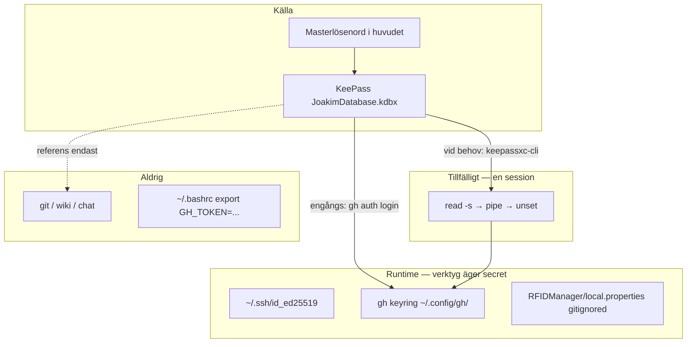

# Utvecklingsmiljö — fakir

Workstation **fakir** (Arch Linux, Hyprland, RTX 3090). Repo: `/home/joakim/Projects/rfid-manager/`.

## Hosts i testmiljön

| Host | Roll | MQTT |
|------|------|------|
| **fakir** | Bygg (`gradlew`), ADB, Ollama/Qwen | **Nej** — ingen broker här |
| **hulda** | Proxmox hypervisor `.100` | Nej |
| **ishtar** | Testlab-gäst (Debian) | **Ja** — broker `:1883`, dashboard `:8000` |
| **falstaff** | Legacy broker | `192.168.50.107:1883` (avvecklas, D.5) |
| **Galaxy Note 10** | Primär testenhet (NFC) | Klient mot ishtar (app default) |

Appens default: `tcp://192.168.50.151:1883` (`MqttConnectionManager.kt`, Uppdrag 004). Testinfra på **ishtar**: broker + dashboard; fakir använder webbläsare/Explorer mot `.151` — se [[Testmiljo-hulda]], [[UAT-fakir-smoke-test]].

## ADB / USB (fakir)

```bash
# Om enhet ej syns
bash ~/Projects/rfid-manager/setup/fix-usb-adb.sh   # kan kräva sudo
adb devices
export ANDROID_HOME=~/Android/Sdk
cd ~/Projects/rfid-manager/RFIDManager
./gradlew installDebug
```

Note 10: USB-felsökning på, auktorisera fakir. Valfritt: `sudo pacman -S android-tools`.

## Hemligheter (secrets)

**Princip:** KeePass är inventarie och källa; varje verktyg lagrar sitt eget runtime-secret. Permanent `export` i `~/.bashrc` eller klartext i git/wiki används inte.



### Tre lager

| Lager | Roll | Exempel på fakir |
|-------|------|------------------|
| **KeePass** | Sanningen — namn, syfte, scopes, utgång | `~/pCloudDrive/Applications/Keepass2Android/JoakimDatabase.kdbx` |
| **Runtime** | Verktyget lagrar efter engångs-setup | SSH-nyckel, `gh` keyring, `local.properties` |
| **Env (tillfälligt)** | Engångs-rör eller CI — inte permanent profil | `read -s GH_TOKEN && … && unset GH_TOKEN` |

KeePass-masterlösenord: bara i huvudet. AI-agenter läser inte KeePass — du matar secrets interaktivt vid behov.

### Omgivningsvariabler — när och när inte

| Situation | Modell |
|-----------|--------|
| Engångs-setup (`gh auth login`) | Env i samma shell, sedan `unset` |
| Daglig drift på fakir | Verktygets inbyggda lagring (`gh`, SSH-agent) |
| GitHub Actions / headless cron | `GH_TOKEN` eller `secrets.*` i CI — inte på fakir |
| App som kräver secret vid körning | KeePass → skript som exporterar i processen, inte globalt |

**Gör inte:** `export GH_TOKEN=…` i `~/.bashrc`, `~/.profile` eller `mise.toml`.

### Checklista (ny secret)

1. Skapa KeePass-entry (namn, syfte, var den används).
2. Installera i verktyg (`gh auth`, SSH, gitignored fil).
3. Verifiera (`gh auth status`, `ssh -T git@github.com`) — inte `echo $TOKEN`.
4. Vid rotation: uppdatera KeePass och logga in om i verktyget.
5. I dokumentation: referera till KeePass-entry — aldrig värdet.

### Inventarie fakir (2026-07-14)

| Secret | Källa (KeePass) | Runtime | Env? |
|--------|-----------------|---------|------|
| GitHub PAT | `GitHub / gh CLI fakir` (eller motsv.) | `gh` keyring | Endast vid setup |
| SSH privat nyckel | Backup/referens valfritt | `~/.ssh/id_ed25519` (mode 600) | Nej |
| KeePass DB | — | pCloud Drive (krypterad fil) | Nej |
| Android `sdk.dir` | — | `RFIDManager/local.properties` | Nej |
| MQTT ishtar `.151` | — | Publik IP i kod/wiki | Inte hemlig |
| Framtida MQTT-auth | KeePass-entry | Ev. `*.local` gitignored + setup-skript | Process, inte profil |

### Aldrig i repo eller wiki

- Lösenord, tokens eller privata nycklar i klartext
- Committa `.env` med riktiga värden — högst `.env.example` med platshållare
- AH-policy: referera till *var* secret finns, inte *vad* det är

## GitHub (fakir)

| Verktyg | Status | Syfte |
|---------|--------|-------|
| **git** via SSH | ✅ `git@github.com` (nyckel `~/.ssh/id_ed25519`) | push/pull |
| **gh** CLI | ✅ PAT (KeePass) + `git_protocol ssh` | releases, PR, API |

Se avsnittet **Hemligheter** ovan för modell. GitHub-PAT: KeePass → engångs `gh auth login` → `gh` keyring.

Diagnostik och instruktioner:

```bash
bash ~/Projects/rfid-manager/setup/github-fakir.sh
```

**Engångs-setup för `gh`** (klar 2026-07-13 — PAT från KeePass):

```bash
read -s GH_TOKEN && echo "$GH_TOKEN" | gh auth login --with-token && unset GH_TOKEN
gh config set git_protocol ssh -h github.com
```

Alternativ: webbläsare — `gh auth login -h github.com -p ssh -s repo,read:org,gist,workflow --skip-ssh-key -w`

Verifiera:

```bash
gh auth status
gh api user --jq .login
gh config get git_protocol -h github.com   # ssh
```

Repos: `JoaBerra/rfid-manager`, `JoaBerra/andra-hjarna` — båda `main`, SSH-remote.

## MQTT-verktyg (fakir, on-demand)

| Verktyg | Kommando | Mål |
|---------|----------|-----|
| MQTT Explorer | `mqtt-explorer` | `192.168.50.151:1883` |
| Dashboard (webb) | webbläsare | `http://192.168.50.151:8000` |

Installerat: AppImage v0.3.5 — `setup/install-mqtt-explorer-fakir.sh`. Se [[MQTT-Explorer]].

## Android SDK (user-local, utan sudo)

Installerad 2026-07-11 via Google command-line tools (alternativ till AUR `android-studio`):

| Fält | Värde |
|------|-------|
| `ANDROID_HOME` | `/home/joakim/Android/Sdk` |
| `sdk.dir` | samma — se `RFIDManager/local.properties` |
| Platform | `android-36` |
| Build-tools | `36.0.0` |
| cmdline-tools | `~/Android/Sdk/cmdline-tools/latest/bin/sdkmanager` |

### Snabbverifiering

```bash
export ANDROID_HOME=~/Android/Sdk
cd ~/Projects/rfid-manager/RFIDManager
./gradlew assembleDebug
```

**Status 2026-07-11:** `BUILD SUCCESSFUL` (~61 s, första körning).

## Beslutsregel: SDK vs Android Studio

**Behåll command-line SDK** som standard för Gradle-byggen, Cursor och agentdriven utveckling (Uppdrag 001/002). Det räcker för `./gradlew assembleDebug` och behöver inte ersättas.

**"System-wide"** på Arch betyder att *IDE:n* hamnar i `/opt/android-studio` (AUR) — **inte** att SDK flyttas ut ur hemkatalogen. Google installerar SDK i `~/Android/Sdk` även med Studio. Det finns ingen praktisk fördel med "system-wide SDK" för detta projekt.

| Behov | Rekommendation |
|-------|----------------|
| Gradle, CI, agent (Qwen/Grok) | Command-line SDK (nuvarande) |
| Emulator, Logcat, Compose preview | Android Studio (AUR) |
| `adb` utan hela Studio | `sudo pacman -S android-tools` |

### Installera Studio när du själv behöver

- Debugga NFC mot fysisk enhet (Galaxy Note 10) med Logcat
- Köra Android-emulator
- Jobba visuellt med Compose/layout

**Inte** som blockerare för bygg eller Uppdrag 002.

### Om du installerar Studio

1. AUR: `paru -S android-studio` (se [[Android-Studio-Installation]] för Hyprland-fixar)
2. Vid första start: välj **befintlig SDK** `~/Android/Sdk` — undvik dubbel installation
3. Låt `RFIDManager/local.properties` peka på samma `sdk.dir`
4. Verifiera: `./gradlew assembleDebug` ska fortfarande fungera

### Valfritt: system-`adb` utan Studio

```bash
sudo pacman -S android-tools
```

Ger system-`adb`/`fastboot` (~10 MB). Vissa föredrar Studios inbyggda `adb` — testa vid behov.

## Lokal AI (Utvecklare-roll)

- Ollama `qwen2.5-coder:32b` på `127.0.0.1:11434`
- Organisation: `andra-hjarna/Organisation/Processer/ollama-fakir.md`

## Relaterat

- [[Utvecklingsmiljö]] — generell Arch/Omarchy-guide
- [[Android-Studio-Installation]] — AUR-installation med Hyprland-fixar
- Andra Hjärnan: `Kunskapsbas/Projekt/rfid-manager.md`